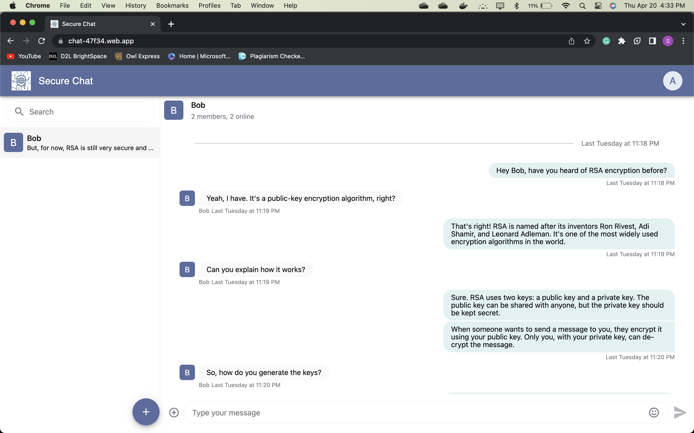

# Secure Chat

A React application using RSA encryption that provides a user-friendly interface and strong security features to protect users' data. The app should allow users to send and receive messages in real time while ensuring that all communications are kept confidential.

## Table of Contents

- [Login Functionality](#login-functionality)
- [Sending a Message](#sending-a-message)
- [Challenges Faced](#challenges-faced)
- [Functions](#functions)
- [Outputs](#outputs)
- [Contributors](#contributors)

## Login Functionality

1. User logins to our application.
2. Then a RSA Asymmetric key pair will be generated.
3. The key pairs are securely stored in the user device in the secure storage.
4. Then user exports his public key to our server.

## Sending a Message

1. Let’s take two users Alice and Bob.
2. Alice tries to send message to bob
   1. Alice scenario:
      1. Alice gets the public key of bob from our server.
      2. Alice encrypts the message with bob’s public key.
      3. Encrypted message will be stored in our server.
   2. Bob scenario:
      1. Fetch the encrypted messages from our server.
      2. Decrypts each message using his own private key.
      3. The step 2 is repeated for all the messages.
3. The above process is vice versa if bob tries to send message to Alice.

So, we can see that the message is only present between the two parties who are communicating.
No one knows other than them.

In this way we can achieve end to end encryption.

## Challenges Faced

1. ~~Exporting the public key in json.~~ (Solved)
2. ~~Let’s say Alice send a message to bob. In our system we are encrypting the message with bob’s public key. So if Alice want’s to decrypt his own message, he cannot do that~~ (Solved)

## Functions

1. generateKeys - Generates a RSA Asymmetric key pair
2. encryptMessage - Encrypts the message with the public key
3. decryptMessage - Decrypts the message with the private key
4. exportPublicKey - Exports the public key in base64 format to the server
5. saveKeys - Saves the keys in the secure storage

## Contributors

See [CONTRIBUTORS.md](CONTRIBUTORS.md)

## Outputs

1. Alice sends a message to bob
   
2. Bob receives the message
   
